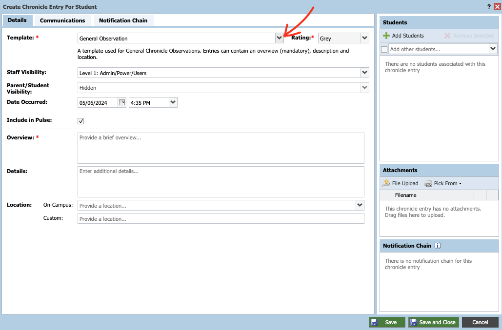

# Compass Chronicle Templates

This is a guide on how to create Compass Chronicle Templates and specifically goes through the process for a template to be used in Health Centre/Sick Bay Action Plans.

### Permissions

Technicians to be able to create this template for your Health Centre you will need the Compass permission 'ChronicleConfigure'

#

Note: Once the template has been set up you will need to check the permissions are correct for the Health Centre staff to see & enter the chronicle templates on student profiles. Typically this permission is under 'SickBayAdmin'

***

## Start
Head to your Student Management then find ‘Chronicle’

  

## Creating a Category

In the Chronicle Dashboard, head to the ‘Administration’ tab and then 'Categories' tab.

Click ‘Create Category’

Give the category a name ie Medical and then set the Visability settings

***

## Creating a Field

Head back to the Administration tab, find the ‘Fields’ tab and click into it.

Under Field Categories, click ‘Create Field Category’

Create a name of the category you want, in this case for McKinnon its Heath Centre / Action Plan

Then, you will need to create Fields linked to that Category under the ‘Fields’ section.

Click ‘Create Field’

In the create field section include the **Name, Field Type, Category** (The previous one you just created), Create a **placeholder** and give it a **description**

These fields are important as they are the extra bits of information that will be included in our template we will make shortly. So think of it like what extra information would I like to have in the template?

Our current Field looks like this;

Some sections in here are custom to your own requrements for the template, however, ours looks like this - 

In the Field's section you can edit the created Field with the pencil icon at the end of the row. 
Here we have a custom field with a grouped checkbox & within that checkbox we have options to tick different catergories within the template. Those look like this;

Once you have created your ideal fields head to the ‘Templates’ tab & click 'Create Template'

***

## Creating the Template

Create a **Template Name** in the text box at the top

Select the **School Category** that you made earlier & give it a **Description**

In the **Template Security** section select the **Staff Visability Level** (Note you will want this low so staff can see the information)

Chose the **Parent/Student Visability** level preferred.

Set the **Default Rating** colour you desire.

***

## Normal Chronicle Use

The Normal Chronicle operation  for a Health Centre staff member would be to head to their Chronicle section.

In the Chronicle Dashboard, Create a new student Entry OR ‘Add a new Sickbay Entry’ by searching for the students ID

Then, selecting the template we have just made in the 'Templates' drop down

Selecting the Health Centre template we have created and you  will see the sections populate - Looking something like;

If doing a first time action plan on a student you can see on the right hand side the ‘Attachments’ section which the Health Centre staff will want to attach the relevant documentation from Parents/GP etc

Lastly, once that has been created you can head back to the students profile page and see the newly created action plan on the right hand side of the profile feed.

Click the drop down on the newly created chronicle entry and pin the chronicle post to keep it at the top of the profile.

And it should look something like this which staff can click on and view if required.

This is an example of what the Student's Chronicle looks like once the action plan has been pinned to their Chronicle.

***