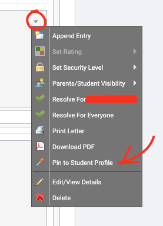

# Compass Chronicle Templates

This is is a rough guide on how the Compass Chronicle Templates are created and specifically goes through the process for Health Centre / Action Plan templates.

## Permissions

To be able to create this template for your Health Centre you will need the highest Compass permissions. Typically something like CompassSponsor level to be able to create the templates for ‘Level 2’ type staff ie Health Centre.

Head to your Student Management then find ‘Chronicle’

## Creating a Category

In the Chronicle Dashboard, head to the ‘Administration’ tab and then Categories tab.

Click ‘Create Category’

Give the category a name ie Medical and then set the Visability settings

## Creating a Field

Head back to the Administration tab, find the ‘Fields’ tab and click into it.

Under Field Categories, click ‘Create Field Category’

Create a name of the category you want, in this case its Heath Centre / Action Plan

Then, you will need to create Fields linked to that Category under the ‘Fields’ section.

Click ‘Create Field’

In the create field section include the **Name, Field Type, Category** (The previous one you just created), Create a **placeholder** and give it a **description**

These fields are important as they are the extra bits of information that will be included in our template we will make shortly. So think of it like what extra bits would I like to have?

Our current Field looks like this;

Once created, head back to the Administration Tab and then click the sub tab ‘Templates’

Here we will form the Template with ‘Create Template’

Some sections in here are custom to your own requrements, however, ours looks like this - 

In the Field's section you can edit the created Field with the pencil icon at the end of the row. 
To input specific tick fields in the later template you can add them in here through the edit pencil button.

Create a Template Name,

Select the School Category that you made earlier & give it a description.

Select the template security level and the Staff Visability Level (Note you will want this low so staff can see the correct information)

Hide the information from students and parents.

Set the defaut rating colour you desire.

Once that has been set up you will need to check the permissions are correct for the Health Centre staff to see & enter the chronicle templates on studnet profiles.

A normal Chronicle use for a Health Centre staff memeber would be to head to their Chronicle.

In the Chronicle Dashboard, Create a new student Entry OR ‘Add a new Sickbay Entry’ by searching for the students ID

Then, selecting the template we have just made in the new Chronicle Entry.

Selecting the Health Centre entry and the template will populate - Looking something like;

All of the preset requirements from the previous steps are populated

If doing a first time action plan you can see on the right hand side the ‘Attachments’ section which the Health Centre staff will want to attach the relevant documentation from Parents/GP etc

Lastly, once that has been created you can head back to the students profile page and see the newly created action plan on the right hand side of the feed.

Click the drop down and pin the new chronicle post to keep it at the top of the profile.

And it should look something like this which staff can click on and view if required.

This is an example of what the Student's Chronicle looks like once the action plan has been pinned to their Chronicle.

